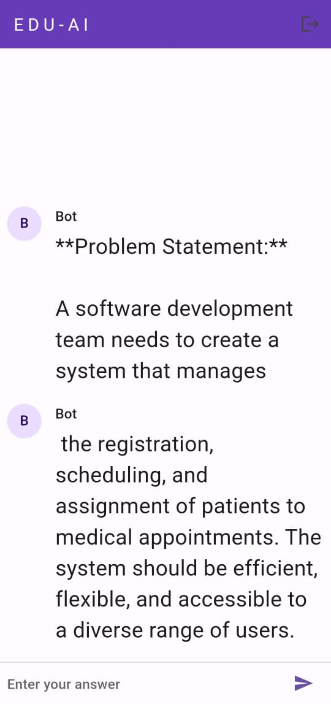
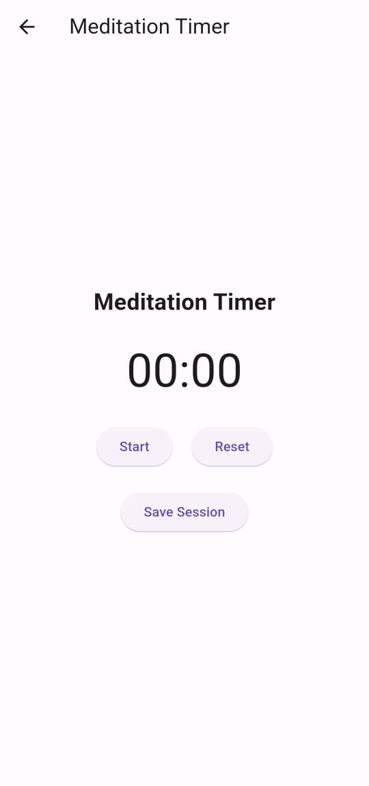
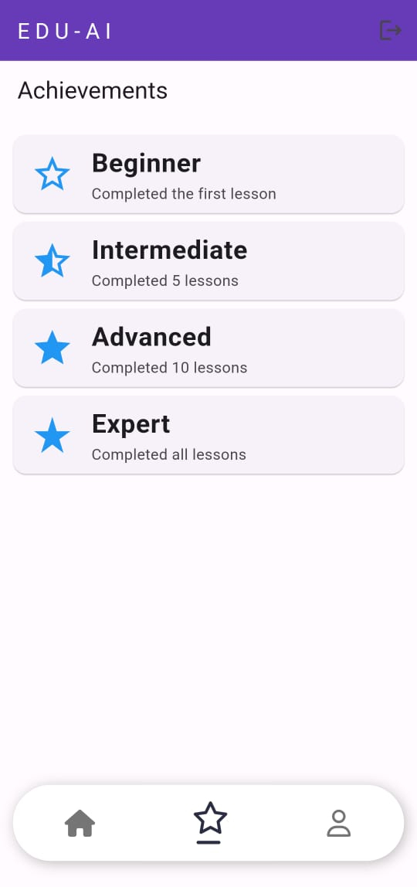

# edu_ai 🌟

edu_ai is an AI-driven education platform designed to enhance the learning experience by providing personalized assistance and support. Through interactive AI-powered modules, quizzes, mental health support, and more, edu_ai aims to make learning engaging, efficient, and accessible for students.

## 🌟 Key Features

- **Learning AI**: Interactive AI-based modules that help students understand complex topics.
- **Problem Solving with AI**: Get instant assistance on questions and concepts that need clarification.
- **Quizzes**: Engage in regular quizzes to test knowledge retention and understanding.
- **Mental Health Support**: Resources and tools to help students manage stress and improve focus.
- **Progress Tracking**: Keep track of your learning milestones and progress over time.

## 🎯 Why edu_ai?

edu_ai aims to revolutionize the education space by providing a platform that combines AI and learning. With its intuitive interface and diverse features, edu_ai helps students enhance their academic journey by providing them with personalized assistance, real-time feedback, and much-needed support for both learning and mental well-being.

## 🛠️ Tech Stack

edu_ai is built using **Flutter** for seamless cross-platform support, allowing the app to function smoothly on both iOS and Android devices.

### Backend

- **Firebase**: For real-time data management and authentication.
- **OpenAI API**: Integrated for natural language processing to assist students in problem-solving.

## 🚀 Getting Started

To get edu_ai running on your local device, follow these steps:

1. Clone the repository:

    ```bash
    git clone https://github.com/Aniudupa15/edu_ai.git
    ```

2. Navigate into the project directory:

    ```bash
    cd edu_ai
    ```

3. Install dependencies:

    ```bash
    flutter pub get
    ```

4. Configure the OpenAI API:

    - Create an OpenAI account and generate an API key.
    - In your project directory, create a `constants` folder inside the `lib` directory if it doesn’t exist.
    - Inside the `constants` folder, create a new file named `api_keys.dart` and add your OpenAI API key as follows:

    ```dart
    // constants/api_keys.dart
    const String OPENAI_API_KEY = 'your-openai-api-key';
    ```

5. Run the app:

    ```bash
    flutter run
    ```

## 📱 Screenshots

| Sign In                                   | Register                                     |
|-------------------------------------------|----------------------------------------------|
|  |  |

| Home Page                                     | Quiz                                             |
|-----------------------------------------------|--------------------------------------------------|
|  |  |

| Profile                                    |Meditation                                              |
|--------------------------------------------|--------------------------------------------------------|
|  |  |

| ChatBot                                                | Achievement                                            |
|--------------------------------------------------------|--------------------------------------------------------|
|  |  |

## 📝 Roadmap

- Enhanced AI problem-solving capabilities
- Expanded mental health resources
- Push notifications for reminders and new quizzes
- Integration with additional educational resources

## 👥 Contributing

We welcome contributions to edu_ai! If you'd like to collaborate, feel free to:

1. Fork the repository
2. Create a new branch
3. Make your changes
4. Submit a pull request

## 📄 License

edu_ai is licensed under the **MIT License**.
